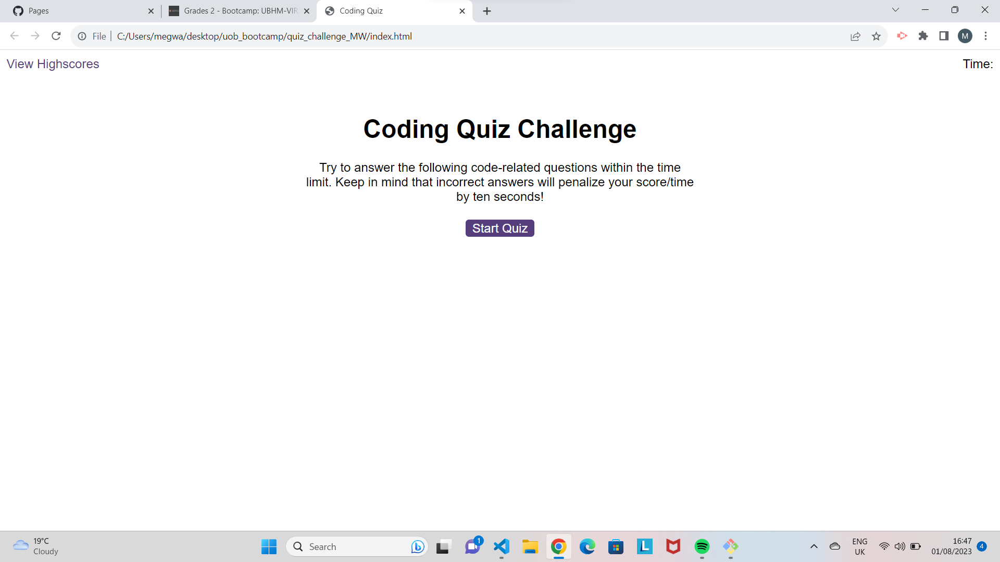

# quiz_challenge_MW

A quiz challenge using JavaScript

In this challenge I have created a short quiz, using JavaScript to access the HTML and CSS elements to change the display and function wwhen the user clicks a button. I have also used it to log and keep track of the score.

I have enjoyed working on this cchallenge. Alhtough I found it daunting at first, I have felt that a lot of what I have been learning about JavaScript has begun to click into place.

If I were to do this challenge again I would experiment more with using the JavaScript to create the HTML elements, such as the answer buttons, to see whether this would make my solutions more efficient.

At the time to submitting I still need to do the following:

- have the countdown deduct time when an incorrect answer is inputted
- be able to correctly store the initials and scores from previous games in the local storage
- create the alerts on the page when an incorrect answwre has been submitted
- build the highscores page

My goal is to go back and complete these tasks to further and consolidate my understanding. However, I am pleased with my progress in this challenge and feel I have made a step forward in using JavaScript.

URL of deployed site :

Screenshot:

I used code/solutions from the sources below to help me in this challenge:

lines 37 - 44 in questions.js
https://www.w3schools.com/howto/tryit.asp?filename=tryhow_js_toggle_hide_show

Lines 62 - 78 - Code refactored and a solution on how to change between questions after tutoring session with Jaytee Padilla.
